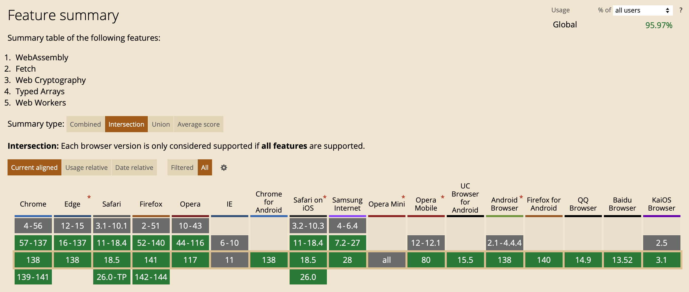

The CAI JavaScript web library (sometimes referred to as the "JavaScript SDK") enables client JavaScript applications to read/validate and write [C2PA](https://c2pa.org/) manifest data.  NOTE: This is in contrast to the legacy JavaScript library, which could only read and validate manifest data. The CAI JavaScript Node library has the same capabilities, but of course runs on the server, not in a browser.

## What you should already know

:::info
The JavaScript web library is intended for experienced JavaScript developers. It uses a number of modern JavaScript technologies, as detailed below. To use the library, you should be familiar with these technologies, and at least one popular build and bundler tool such as [Webpack](https://webpack.js.org/), [Rollup](https://rollupjs.org/), or [Vite](https://vitejs.dev/).
:::

### Technologies that the library uses

The JavaScript library uses several modern browser technologies, including:

- [WebAssembly](https://webassembly.org/)
- [Web Workers](https://developer.mozilla.org/en-US/docs/Web/API/Web_Workers_API)
- [Web Crypto API](https://developer.mozilla.org/en-US/docs/Web/API/Web_Crypto_API)
- [Typed arrays](https://developer.mozilla.org/en-US/docs/Web/JavaScript/Typed_arrays)
- [Fetch API](https://developer.mozilla.org/en-US/docs/Web/API/Fetch_API)

## Overview

The JavaScript web library is a monorepo containing the following packages intended for client use:

- [**c2pa**](https://opensource.contentauthenticity.org/docs/js-sdk/api/c2pa) is the main package used for loading and verifying manifests. This package runs all of the processing logic on the client using a [WebAssembly](https://webassembly.org/) module and exposes a [TypeScript](https://www.typescriptlang.org/)-compatible API for easy integration.
- **c2pa-wc** provides UI components designed with input from the C2PA UX working group. It enables users to get up and running with standard UI patterns quickly and easily in any front-end environment.
- **@contentauth/react** provides a hooks interface for React components to quickly get manifest and thumbnail data in your React app.

To learn how to use these libraries, see the [Quick start](quick-start).

Additionally, the library includes the following supporting packages that are _not_ intended for separate use:

- **@cai/toolkit** contains the WebAssembly module, data binding functions, and related build tools. The `c2pa` package consumes this library under the hood. The WebAssembly module handles manifest parsing and validation.
- **@cai/detector** provides a high-performance binary scanner to quickly detect if C2PA manifest data exists in a file. The `c2pa` package also consumes this library.

## Features

Key features of the JavaScript library include:

- **Developer friendly**: Full TypeScript support and robust debugging support using the [debug](https://github.com/debug-js/debug) library make integration easy.
- **Performance**: The processing code of the library uses a high-performance [WebAssembly](https://developer.mozilla.org/en-US/docs/WebAssembly) binary. Additionally, the library offloads processing tasks to a configurable Web Worker pool to enable parallelization and avoid blocking a web application's main thread.
- **Lazy loading and processing**: Since images can be quite large, the library inspects the start of an asset file for C2PA manifest data before requesting the entire file, [if the server supports it](../guides/hosting#range-requests). The library will download the rest of the asset only if it finds the metadata marker. Additionally, it delays loading the WebAssembly binary until it makes the first processing request.
- **Adherence to the C2PA specification**: The library strives to maintain compliance with the [C2PA specification](https://c2pa.org/specifications/specifications/2.2/specs/C2PA_Specification.html) as much as possible, and the web components follow the [C2PA user experience guidance](https://c2pa.org/specifications/specifications/1.0/ux/UX_Recommendations.html) recommendations.
- **Security and encryption**: The library handles all [validation](https://c2pa.org/specifications/specifications/2.2/specs/C2PA_Specification.html#_validation) via the [Web Crypto API](https://developer.mozilla.org/en-US/docs/Web/API/Web_Crypto_API) and passes any validation errors back to the client. It supports all ECDSA and RSASSA-PSS algorithms listed in the [C2PA specification](https://c2pa.org/specifications/specifications/2.2/specs/C2PA_Specification.html#_digital_signatures).
  :::caution
  The JavaScript library does not currently support Ed25519 signatures.
  :::caution
- **Framework-agnostic**: The UI components are [Web Components](https://developer.mozilla.org/en-US/docs/Web/Web_Components) that use the [Lit library](https://lit.dev/). Because of this, you can use them in [React, Vue, Angular, Svelte](https://custom-elements-everywhere.com/), or even vanilla JavaScript.

## Browser support

The JavaScript library uses several [modern browser technologies](#technologies-that-the-library-uses).
Because of these requirements, **the library is not supported on any version of Internet Explorer and on a few less-used mobile browsers**. The chart below from [caniuse.com](https://caniuse.com/wasm,webworkers,cryptography,typedarrays,fetch) summarizes the browsers and versions that support the library.



:::info
This chart is accurate as of July, 2025. For the most up-to-date browser support information, see [caniuse.com](https://caniuse.com/wasm,webworkers,cryptography,typedarrays,fetch).
:::

## Debugging

The JavaScript library uses the [debug-js](https://github.com/debug-js/debug) library to get debug-level information under the `c2pa` namespace.

To view debug messages in the console, use your browser's inspector, go to the Console tab, and enter:

```js
localStorage.debug = 'c2pa:*';
```

The debugging information includes millisecond timing differences so you can get an idea of how long different events take.

:::note
Debug calls and statements are stripped out of minified production builds to reduce file size.
:::

To turn off debugging, enter:

```js
localStorage.debug = false;
```
